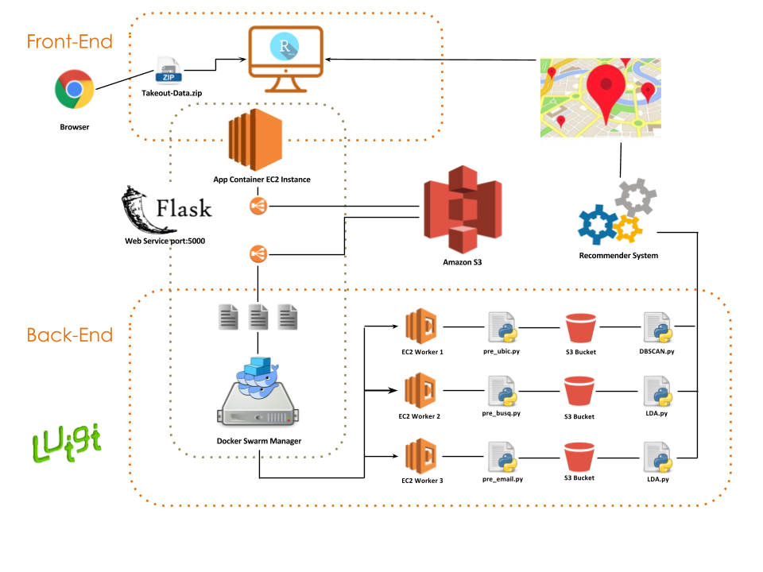

# The Shape of The Data

## Google Data

On every field of Data Science, the researcher has to be clear about the data sources is using, it is important to identify the variety and the types of format is built of. First, let's take a look at the data and its nature, so after downloading `Google Takeout` Data one has to be able to handle the data format.  

As is said before, this study used three Google sources, `Mail`, `Searches` and `Locations`, because is considered the most used for an average person nowadays, on forwarding studies and developments, is planned to add more Google applications, e.g. Google Chrome history, Contacts, YouTube, and Drive are the most interesting.  

The file format used for Search and Location history is [json](http://www.json.org/json-es.html) there some approaches to use this kind of data, and is getting more popular and well documented, on [jq Manual](https://stedolan.github.io/jq/manual/) is very clear to see.  

On the other hand, the transformation of data from [mbox](https://en.wikipedia.org/wiki/Mbox) to readable is quite more difficult because does not have a regular shape, we defined where each email is identified and separated from each one part of the same body, anyway there are some `Python` libraries that are very helpful.  

Part of the `Exploratory Data Analysis` is to create a `Graph DataBase` to represent the network of the mails and identify the people with whom the user have more interaction, the tool used is [Neo4j](https://neo4j.com/). Finally, we extracted keywords of the mails and searches to detect important topics in them.  

The researcher has to notice that one has to start with some questions, and actually before to beginning to answer ourselves it is been found that there are some general observations when the datasets was explored.  

The amount of data varies for each account and for the cases explored, the data are available since 2011 (when Google Takeout project starts). Even though all the Search data is splited on various `json` files of 100 kb each (on average). A user has Location History as long as the user gives permission on the cellphone, actually, it is been found out the location accuracy got better over the time, presumably because the GPS got better over the time as well.   

Furthermore, we have to settle some questions about how can we get the data.  

## Email Data

What insights can we get? 

+ How is the traffic over time?
+ Is it possible to make a network of people?
+ What is the relationship of sent with received?
+ Does the subject matter mean anything?

How the data looks like?

        X-GM-THRID: 1545043292255087830
        X-Gmail-Labels: Importante,Destacados,Recibidos
        From: <ventasweb@interjet.com.mx>
        To: <xxx@gmail.com>
        Reply-To: <ventasweb@interjet.com.mx>
        Date: Fri, 9 Sep 2016 19:41:43 -0500
        Subject: Interjet Itinerario
        Content-Type: multipart/alternative;
        Message-ID: <e34b7917-c506-4a84-ac90-626bf8fafb7a
        Content-Transfer-Encoding: quoted-printable
        —CONTENT—

## Search Data

What insights can we get? 

+ How are searches by hour, day, month?
+ Are there long search times?
+ Productive searches?
+ Do the most wanted words say anything?

How the data looks like?

        {"query":       
            {"id":          
                [{"timestamp_usec":"1407774749032392"}],        
            "query_text":"banco mundial"}}  
        {"query":       
            {"id":          
                [{"timestamp_usec":"1407774749075527"}],        
            “query_text":"data lake"}}  
        {"query":       
            {"id":          
                [{"timestamp_usec":"1407774749095273"}],        
            “query_text”:"shiba dog"}}

## Location Data

What insights can we get? 

+ What is the frequency of movements?
+ Can work and home be identified?
+ When is a move identified?
+ What are the average transfers in time and distance?

How the data looks like?

        {"timestampMs": "1414819151315",    
            "latitudeE7" : 204435729,    
            "longitudeE7" : -872882348,    
            "accuracy" : 49,    
            "activitys" : [ { "timestampMs": "1414819136573",
                  "activities" : [ { "type" : "inVehicle", "confidence" : 62 }, 
                                { "type" : "still", "confidence" : 29       },
                                { "type" : "onBicycle", "confidence" : 5 },
                                { "type" : "unknown",  "confidence" : 5 } 
                                  ]    
                          } ] 
         }

### Data Pipeline

In order to conduct the study and the application development we have to try to answer those questions and have a scope to get information with data merged to make the recommender system accurate.  

We also might make a list of reachable tasks:  

+ Estimate a level of area as neighborhood or city where the user has lived or worked, let's call them, Favorite Places.
+ Identify, through locations combined with searches, tastes or additional activities of the user.
+ Find a network related with searches
+ Estimate what the user is engaged in, by correlating emails and searches.
+ Make clusters in order to find places of interest
+ Generate recommendations based on the profile of what you consume daily
+ Frequencies for each location level for time window
+ Extract "zone" more frequently and define it as "residence city".

A high leve pipeline could be

Figure 1. The Data Pipeline of Go Google Yourself!
