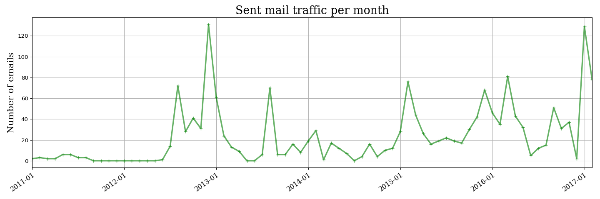
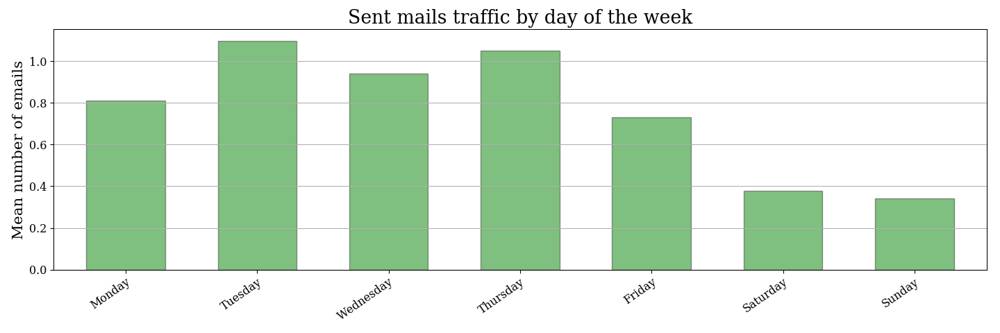
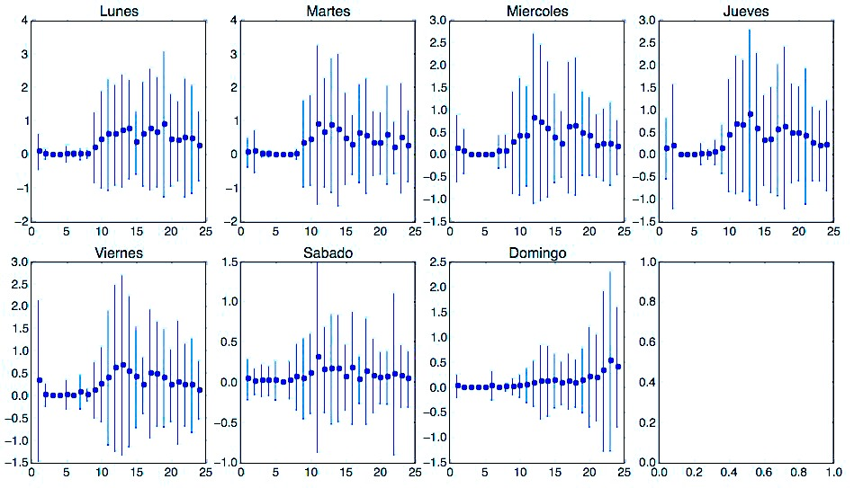

# Exploratory Data Analysis

On every Data Science study the researcher has to follow a certain path, at this stage, once the laborious task of data manipulation is done, the next step to follow in the process is to become intimately familiar with the data set by performing Exploratory Data Analysis (EDA). The way to gain this level of understanding is to utilize the features of the statistical environment the researcher is using that support this effort.[5]  

It is always a good idea to explore a data set with multiple exploratory techniques, especially when they can be done together for comparison. Naturally, every dataset is different, sometimes one has to deal with many features or many samples, or just the opposite. The notion that has been followed is document oriented because Google data give text, we might say that every search or every mail is a document that belongs into a `Corpus`.

For this development, it ain't has a large amount of features but and important amount of effort to merge the data. Then, it is quite possible that one may need to revisit one or more data manipulation tasks in order to refine or transform the data even further. The goal of exploratory data analysis is to obtain confidence in the data to a point where one is ready to engage a machine learning algorithms.  

On this section the reader is going to be able to replicate the Exploratory Data Analysis despiting the web app itself, with the only intention to make clear that before make modeling the researcher has to know the insights the data can say, on this study, the problem is not the number or complexity of features but how connected they are because is all about text and georeference.  

Go to code on annexed section.  

## Network Analysis

What if because of my networking one is tended to make different choices? Is it the same relevance that one send ten emails to ten persons than send ten emails to two persons?  

Well, it is quite difficult to see at the first gaze, and maybe we have to make a deeper in-degrees and out-degrees analysis on e-mail networking. But the notion is going to follow is on popular a topic is around the net. On the image is clear to see where is the center of the graph, that center of gravity is the main user related with all the networking, then one can see communities, of course it depends on the user how big the communities is, the sure thing is that hwere is a community is a internet domain related on that community, actually the prediction is going to take the domains along with subjects to find the topics.   


Figure 2. Email Networking

Figure 2 shows the user's email networking, this is launched on [Neo4j](https://neo4j.com/), the main idea here is to try to find communities, threads and influence nodes. Let's find the biggest email threads, once we got it, we visualize the longest path, using cypher query language  
  
```sql 
MATCH p=(e:Email)<-[:REPLY*]-(r:Email)<-[]-(sender:Account)
WHERE NOT (e)-[:REPLY]->()
RETURN sender.name, e.subject, Id(e), length(p) - 1 AS depth
ORDER BY depth DESC
```

To achieve a database based on graph we used a parser built on [Go](https://golang.org/) programming language, helped on a `.mbox` reader built in [Perl](https://www.perl.org/), this following might be a little summary of `email2neo4j`package, the researcher can find some more documentation [here](https://github.com/tolomaus/email2neo4j), the main idea is parsing the relevant emails. The package has a `mbox2neo4j` `Go` command line tools that allows to import emails from an mbox file into a neo4j graph database. It used a model from the email example project that is explained in Chapter 3 of the book [Graph Databases](http://graphdatabases.com/) by Ian Robinson, Jim Webber and Emil Eifrem, which is a truly great introduction to the graph.

First we have to take the attachments of the e-mailsxs

On terminal:  

        perl strip-attachments.pl /path/to/mbox/file.mbox

Then

        mbox2neo4j /path/to/mbox/file localhost:7474

After the networking EDA is well known that show the graph itself is not the most important thing for the final user but shows the recommendation and insights are what creates engagement. The network analysis itself helps the researcher how one can moves on the feature engineering task.  

## Emails EDA

The emails we send, we receive, or we mark as a favorite can make a big difference between us. At this moment it ain't care about spam email, just how frequent an email address is and how big is a conversation, that is why is important to know the distribution of the emailing traffic, then is suitable to know when recommend, as we see before the more we know the user data the accurate the recommendation.  

The e-mail traffic analysis through the time is partially based on [Geoff Boeing](http://geoffboeing.com/) work, and it is been developed on `python`. Naturally, the first thing the researcher has to do is make a count of messages, then make some other countings by modules.  

It is significant to say that Gmail mbox file includes emails and hangouts chats among its messages. Hangouts messages don't have date/time, so one have only to parse dates and times from the actual emails, and just ignore the hangouts chats. Also, some chats do have a date. To filter them out, verify that if the message has a label that the label does not include Chat.


Figure 3. Traffic by day


Figure 4. Traffic by month


Figure 5. Traffic by the day of the week


Figure 6. Traffic by the hour of the day


Figure 7. Traffic by the hour of the day

As it can be seen here if one want to develop a recommender system around this user better send ads based on how likely the user is online, it can be known that when he/she is writing emails down. For this user the most likely time is around 10 to eleven and 16 to 17, Tuesdays and Thursdays, and also is important to say that there's such an active account between November and February.  


## Search EDA

It is very important to get insights of the searches' data because is going to help to find highlights keywords whose will deprecate the sites of interest the application is going to recommend.  

When it is been analyzed the user searches, it is considered two approaches that allowed to detect relevant characteristics and activities of the user and to use this information obtained in the recommendation.  

First, to detect topics in a general is to build a full corpus, where we can detect general characteristics of the user using automatic clustering algorithms, then compare the outputs of the different algorithms and determine the number of topics.  

Secondly, it is been sought to analyze the user search periods, once the most important issues are detected in the first step, to detect the periodicity in terms of frequency and search topics. In this way, we will be able to detect if the identified issues correspond to activities that the user still performs, that already has time without realizing them or that has been doing them for a long time, later we use this information in the algorithm of recommendation.  

In both cases, an automatic detection is sought. To achieve these goals we consider the following characteristics of Google searches:  

1. They do not require grammatical rules to be able to show a result
2. It is advisable to perform searches without punctuation marks to achieve better results
3. Google is able to interpret languages without specifying the language in which you are writing

Considering these characteristics, we observe that the steps for pre-processing the text decrease, and it is also necessary to perform it in different languages, in this case, it will be done in English and Spanish, which are the most frequently used languages among our users. Although later research may include automatic language detection tools to perform automatic cleaning of the text, according to the corpus being processed.  


Figute 8. Search frequency by day and hour


## Location EDA

The main input it is been used is the location history file, that is because the application is going to recommend the sites of interest around the most visited places. In other words, we seek to describe the daily activity of the person and define their most frequent places (e.g. home, office or school).  

One might say that during the day, a person performs two types of activities: staying in one place or moving to another.  

When a person visits a place, they tend to stay at that location for at least 10 minutes (can be extended to hours in home, office or school cases) which generates at least 17 location records.  

When the person moves from one place to another, a series of location records are generated along the transited space. These records may or may not be close (geographically) depending on the transfer speed. In the other hand, if the user registers a time stop in traffic, it is possible, although unlikely, to confuse the place as a visit (depending on the tolerance taken for each visit). As a result of the day, location records generate a cloud of points with areas of high and low density.  

In order to define the places visited during the day, it is proposed to use the `DBSCAN` Model which is an unsupervised clusterization algorithm based on density. When DBSCAN is been used, unclassified points and points clusters are obtained. It will be assumed that points within a cluster are variations due to GPS accuracy or internal movements within the building. Also, within the clusters are the last records obtained during the displacement towards said cluster and the first records of the transfer to the next place. In order to define the visited location (the main one), the average of the records of each cluster will be taken excluding the first and the last in order to reduce the error caused by clustering.  

The unlabeled points correspond to transfer location records. Also, was quite hard to define the frequent places, so we used a window of 30 days in order to detect if the period of analysis is a common period or a change of address (work or school) or a holiday period.  

As it can be seen on the next outputs, first it shows the most frequent places, then retrieval of the places where is home or work presumably, finally is clear to see how much time a person spend on moving from a point to another.  

    2017-03-21 2017-03-11
    {0: 0, 1: 914, 2: 268, 3: 0}
    {0: 1386, 1: 3333, 2: 830, 3: 1040}
    {0: 'Edificio 10, Altavista, Ciudad de México, CDMX, Mexico', 1: 'Cerro San Francisco 305, Campestre Churubusco, 04200 Ciudad de México, CDMX, Mexico', 2: 'Cto. Interior Maestro José Vasconcelos 208, Condesa, 06140 Ciudad de México, CDMX, Mexico', 3: 'Torre C, Av Sta Fe 505, Santa Fe, Contadero, 01219 Ciudad de México, CDMX, Mexico'}


    Casa  1 :  Cerro San Francisco 305, Campestre Churubusco, 04200 Ciudad de México, CDMX, Mexico
    Trabajo/Escuela  0 :  Edificio 10, Altavista, Ciudad de México, CDMX, Mexico
    Trabajo/Escuela  1 :  Cerro San Francisco 305, Campestre Churubusco, 04200 Ciudad de México, CDMX, Mexico


    0 1900-01-01 22:52:04.600000 1900-01-01 20:23:29.400000
    Paseo de la Reforma 50, Miguel Hidalgo, 11550 Ciudad de México, CDMX, Mexico
    1 1900-01-01 22:54:49.300000 1900-01-01 18:35:55.700000
    Felipe Villanueva 19, Guadalupe Inn, 01020 Ciudad de México, CDMX, Mexico
    2 1900-01-01 16:45:28.700000 1900-01-01 10:27:10.300000
    Torre C, Av Sta Fe 505, Santa Fe, Contadero, 01219 Ciudad de México, CDMX, Mexico
    3 1900-01-01 07:25:18.700000 1900-01-01 00:50:28.300000
    Cerro San Francisco 309, Campestre Churubusco, 04200 Ciudad de México, CDMX, Mexico
    amaneciste en 3
    Llegaste a  3  a las:  00:01:07
    --Tiempo de traslado:  0:00:00
    Te fuiste de  3  a las  08:14:40
    Llegaste a  2  a las:  09:39:53
    --Tiempo de traslado:  1:25:13
    Te fuiste de  2  a las  17:32:46
    Llegaste a  1  a las:  18:03:34
    --Tiempo de traslado:  0:30:48
    Te fuiste de  1  a las  19:48:47
    Llegaste a  0  a las:  20:04:55
    --Tiempo de traslado:  0:16:08
    Te fuiste de  0  a las  23:10:39
    Llegaste a  1  a las:  23:21:48
    --Tiempo de traslado:  0:11:09
    En el día usaste 2:23:18  para desplazarte


Figure 9. Clusters found on the map

